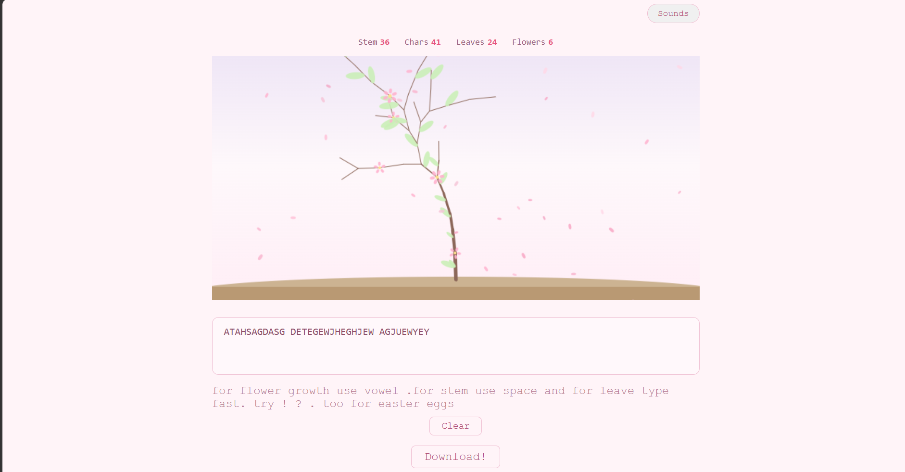

# Type2Growth
A PROCEDURAL APP IN WHICH YOU TYPE TO GROW YOUR GARDEN TREE 

## GUIDE 
SEE THE  VIDEO AS THEY EXPLAIN BETTER

[]
(https://youtu.be/yFScWrc2F5A?si=3YzLyFfT6XGiaEwS)

## DASH

#  HOW I MADE IT

TECH USED-

    JS FOR MAIN AND CORE LOGIC AND ANIMATING
    CSS FOR GIVING LIFE TO WEBSITE AKA DESIGNING
    HTML FOR BASE
    MY LAPTOP FOR CODING

I USED ANIMATION FEATURES AND JS MATH AS WELL AS ALSO READ DOCS FOR STYLES AND WHEN I THOUGHT I HAVE ENOUGH KNOWLEDGE I STARTED 

MVP-JABHASCRIPIT

## WHAT I PERSONALLY LEARNED

I LEARNED JS MATHS  AND LOGIC HANDLES

I ALSO USED AI EFFICIENTLY FOR INFERRING ANGLES AND AFTER ASKING 1 TO 2 TIME I GOT THE CONCEPT STICKED

## THE GAMEPLAY STYLE IS EASY NO SUCH GRIND AND IS ENDLESS 

## TO RUN JUST OPEN THE DEMO LINK - https://atharva123aa.github.io/Type2Growth/

## IMPORTANT THINGS TO NOTE

I USED AI IN JS ONLY LIKE FOR 15 TO 20 % OF WORK AND THAT TOO ONLY IN MATH LOGIC AND IN 2 TO 3 PLACE ANGLE 

IT WAS A BETTER WAY TO LEARN RATHER THAN BROWSING STACK OVERFLOW

# GOALS-

IN NEXT UPDATE (SOON) I WILL ADD EVENTS EXTRA GARDENS TRADE FEATURE MORE WEATHER AND EVEN MULTIPLAYER SO LET SEE THAT WILL I STICK TO THIS

# THANKS TO ALCHEMIZE TEAM AND READER

# IGNORE IF NOT   A REVIEWER

# THEME SELECTION- ENDLESS

I CHOSE THIS THEME BECAUSE THE GAME ITSELF IS PROCEDURAL WITH ALL SIGNIFICANT PARTS LIKE WEATHER CAHNGE TYPE GROWTH AND ETC. AND IT ALSO NEVER ENDS AND THINGS GENERATE ON THIER OWN SO THIS WAS MY SELECTION

# SPECIAL THANKS TO ME AND VS CODE! NOW GO ENJOY IDIOT 
