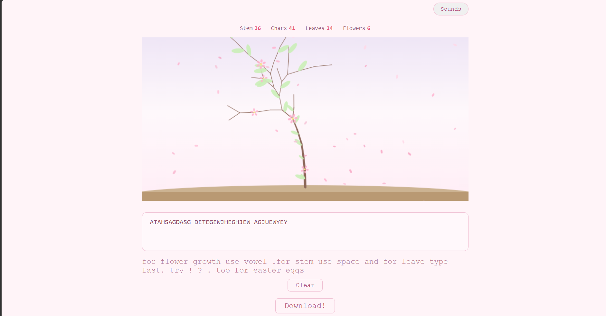

# Type2Growth
A PROCEDURAL APP IN WHICH YOU TYPE TO GROW YOUR GARDEN TREE 

## GUIDE 
SEE THE  VIDEO AS THEY EXPLAIN BETTER

[]
(https://youtu.be/Hz88llKLT6s)

## DASH

#  HOW I MADE IT

TECH USED-

    JS FOR MAIN AND CORE LOGIC AND ANIMATING
    CSS FOR GIVING LIFE TO WEBSITE AKA DESIGNING
    HTML FOR BASE
    MY LAPTOP FOR CODING

I USED ANIMATION FEATURES AND JS MATH AS WELL AS ALSO READ DOCS FOR STYLES AND WHEN I THOUGHT I HAVE ENOUGH KNOWLEDGE I STARTED .I ALSO USED SOME NICE WEBKIT FEATURE TOO THAT I USED DOCS TO STUDY AND WITH A LIL BIT AI HELP THEY GOT ME 
MVP-JABHASCRIPIT

## WHAT I PERSONALLY LEARNED

I LEARNED JS MATHS  AND LOGIC HANDLES

I LEARNED COOL CSSES

I ALSO USED AI EFFICIENTLY FOR INFERRING ANGLES AND AFTER ASKING 1 TO 2 TIME I GOT THE CONCEPT STICKED AND I USED IT AS MY LEARNING PARTNER FOR CSS ADVANCE FEATURE AND YES THE DEBUG PART OF JS LIKE A LIL BIT NOT MUCH

OVERALL AI USAGE-~20%

## THE GAMEPLAY STYLE IS EASY NO SUCH GRIND AND IS ENDLESS 

## TO RUN JUST OPEN THE DEMO LINK - https://atharva123aa.github.io/Type2Growth/

## IMPORTANT THINGS TO NOTE

I USED AI IN JS ONLY LIKE FOR 15 TO 20 % OF WORK AND THAT TOO ONLY IN MATH LOGIC AND IN 2 TO 3 PLACE ANGLE 

IT WAS A BETTER WAY TO LEARN RATHER THAN BROWSING STACK OVERFLOW

IN THIS GAME YOU FACE ANY BUG MAIL-@atharva123aa@gmail.com

THE CREATOR IS VERY ACTIVE SO EXPECT NEW UPDATES WITH COMMITS LIKE YES A MAJOR UPDATE IS THERE EVERY DAY AS OF NIW

# GOALS-

IN NEXT UPDATE (SOON) I WILL ADD EVENTS EXTRA GARDENS TRADE FEATURE MORE WEATHER AND EVEN MULTIPLAYER [SO LET SEE THAT WILL I STICK TO THIS]

I WILL ADD SOME FEATURE LIKE A WHOLE RUNNER AND MORE TO SEE NO PROMISE NOW

# UPDATES

NEW SHOP FEATURE 

NEW COMPATIBLITIY WITH PHONE

MORE FLOWERS EFFECTS

SPECIAL BOOST ON TYPING

BROWSE NOW

NEW MAP 

HORROR SFXES

BETTER INTERFACE

THEME SWITCH

ADHERE TO FEATURES IN VIDEO

{SOME BLESSING ALSO ADDED}

# THANKS TO ALCHEMIZE TEAM AND READER

# IGNORE IF NOT   A REVIEWER

# UPDATE NOTES-

I ADDED NEW FEATURES LIKE WPM AND HASTE AND WILT BAR A NEW MAP AND NEW COLLECTIBLE STUFFS AS WELL AS MANY SOUND IMPROVEMENT AND MADE SOME BUG FIXES TOO.

I ADDED FEATURES LIKE FLOWER FRUIT BLOOM FOG DUST AND ALSO WORKED ON THE THEME

# THEME SELECTION- ENDLESS

I CHOSE THIS THEME BECAUSE THE GAME ITSELF IS PROCEDURAL WITH ALL SIGNIFICANT PARTS LIKE WEATHER CAHNGE TYPE GROWTH AND ETC. AND IT ALSO NEVER ENDS AND THINGS GENERATE ON THIER OWN SO THIS WAS MY SELECTION

# SPECIAL THANKS TO ME AND VS CODE! NOW GO ENJOY IDIOT 
